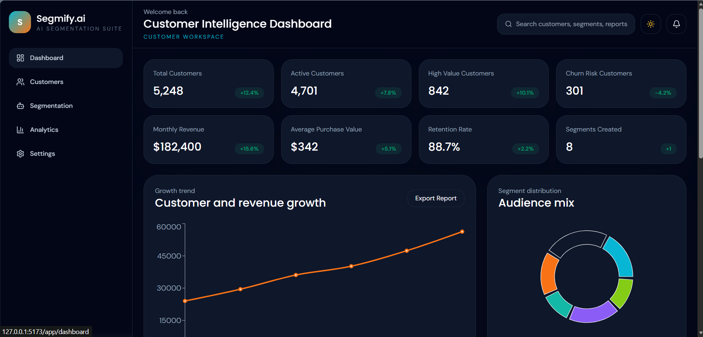

# Segmify.ai

Smart Customer Segmentation Powered by AI

Segmify.ai is a production-style SaaS starter for customer segmentation and customer insight prediction. It includes a modern React dashboard, a FastAPI backend with JWT auth and RBAC, an ML pipeline powered by scikit-learn, reporting utilities, Docker support, and realistic sample data generation.

## Stack

- Frontend: React, Tailwind CSS, Recharts, Axios, Framer Motion
- Backend: FastAPI, SQLAlchemy, JWT auth, RBAC
- Database: SQLite for development, PostgreSQL-ready configuration
- Machine Learning: Pandas, NumPy, scikit-learn, Matplotlib, Seaborn
- Deployment: Docker, env-based configuration

## Project Structure

```text
Segmify.ai/
|-- backend/
|-- frontend/
|-- data/
|-- docs/
|-- ml/
|-- docker-compose.yml
`-- .env.example
```

## Features

- SaaS-style landing page with animated hero, pricing, testimonials, and CTA flows
- Role-aware dashboard experience for Admin, Business Analyst, and Standard User
- Customer CRUD API, search, filters, exports, and activity logging
- ML training and prediction endpoints for customer segmentation
- Analytics dashboard cards, charts, activity feed, and recommendation blocks
- Report generation, notifications foundation, and admin APIs
- Dockerized local setup and architecture/deployment docs

## Quick Start

### Backend

```bash
cd backend
python -m pip install -r requirements.txt
python seed.py
uvicorn app.main:app --reload
```

### Frontend

```bash
cd frontend
npm install
npm run dev
```

### Windows one-command startup

```powershell
.\run_app.ps1
```

The app opens the backend at `http://127.0.0.1:8000` and the Vite frontend at `http://127.0.0.1:5173`.
Default seeded login: `admin@segmify.ai` / `Admin@123`.

### Dataset

```bash
python data/generate_dataset.py
```

This creates `data/customers_5000.csv` with 5,000 realistic customer records.

## API Highlights

- `POST /api/v1/auth/register`
- `POST /api/v1/auth/login`
- `GET /api/v1/auth/me`
- `GET /api/v1/customers`
- `POST /api/v1/customers`
- `POST /api/v1/segmentation/train`
- `POST /api/v1/segmentation/predict`
- `GET /api/v1/analytics/dashboard`
- `POST /api/v1/reports/export`
- `GET /api/v1/admin/logs`

Interactive Swagger docs are available at `/docs` when the backend is running.

## Testing

```bash
cd backend
pytest
```

## Notes

- The password reset, email verification, chatbot, and live notification flows are scaffolded as integration points and can be connected to external providers.
- The frontend is prepared for API integration through `frontend/src/lib/api.js`.
- Use PostgreSQL in production by changing `DATABASE_URL` in `.env`.
# 📸 Project Screenshots

## 🏠 Home Page
The landing page introduces Segmify.ai and highlights its AI-powered customer segmentation capabilities.


## 🏠 Home Page - Features Overview
Showcases platform features, benefits, and segmentation workflow.


## 🏠 Home Page - Additional Information
Provides additional insights into the platform and customer segmentation process.


---

## 🔐 User Login Page
Secure login portal for customers to access segmentation services.


## 🔐 Login Page
Authentication interface with user account access.


---

## 📊 Dashboard
Central dashboard displaying customer analytics, segmentation statistics, and key metrics.



---

## 📝 Customer Data Input
Form for entering customer demographic and behavioral information for segmentation analysis.


---

## 🤖 AI Assistant
Integrated AI assistant providing guidance and recommendations.


## 🤖 AI Assistant - Advanced Features
Enhanced AI interaction for customer insights and segmentation support.


---

## 🎯 Customer Segmentation Results
Displays generated customer segments using the K-Nearest Neighbors (KNN) algorithm.


## 🎯 Detailed Segmentation Analysis
Provides detailed analysis and visualization of customer groups.


---

## 👨‍💼 Admin Login Page
Administrator authentication portal.


## 📈 Admin Dashboard
Admin panel for monitoring users, analyses, and system performance.


## 🔔 Admin Notifications
View customer inquiries and system notifications.


## 📋 Admin Reports
Generate and manage customer segmentation reports.


