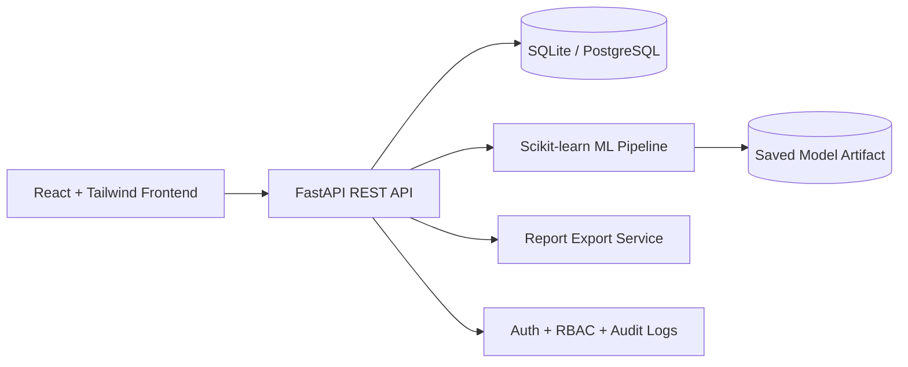

# Segmify.ai Architecture

## Modules

- `frontend/`: Landing page, auth flows, dashboard pages, charts, theme support, and reusable UI components.
- `backend/`: FastAPI services, routes, SQLAlchemy models, JWT auth, analytics, reports, and admin APIs.
- `ml/`: Model training entry point and persisted ML artifacts.
- `data/`: SQLite database, exports, and the generated customer dataset.
